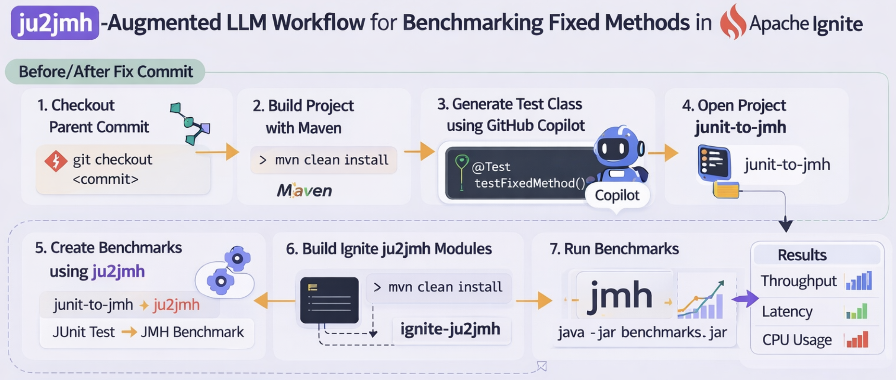
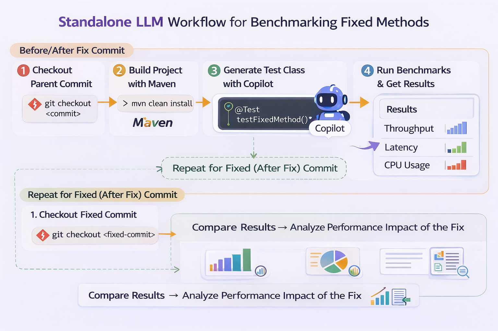

# EvaluatingAutomatedMethods4MicrobenchmarkGeneration
Evaluating Automated Methods for Microbenchmark Generation is a study that analyzes how different automated methodologies (ju2jmh-augmented LLM and standalone LLM) impact the sensitivity and accuracy of regression detection campaigns in the context of Performance Engineering.

# Methods Overview
This study explores and evaluates automated methods for generating performance microbenchmarks, focusing on two distinct approaches: ju2jmh, an automation tool that converts unit tests into microbenchmarks, and Large Language Models (LLMs), such as GPT-4, which directly generates microbenchmarks from source code.

### ju2jmh+LLM approach

The following structure details the execution of this methodology as applied to the Apache Ignite project, focusing on the isolation and detection of performance regressions.

### Standalone LLM approach

The standalone LLM approach serves as a critical comparative baseline in this research, representing a "pure" generative methodology for performance test creation.

## Obtained Results

This study answers a Research Question:

> Between ju2jmh-augmented LLM and standalone LLM, which approach is more effective at detecting performance regressions?

You can find the full information in [the Master Thesis document](docs/Master_Thesis.pdf)

## Project Structure

- [analysis](analysis/) - comparison results.
- [data](data/) - benchmark results.
- [img](img/) - images of the structure of both approaches.
- [ju2jmh-augmented_llm](ju2jmh-augmented_llm/) - additional files for the ju2jmh-augmented LLM approach.

## Method workflow

### Configuration setup

To ensure reproducibility of the benchmarking experiments, the following environment configuration was used.

### Required Tools & Versions

| Tool        | Version     | Purpose |
|-------------|------------|--------|
| Java        | 8          | Build and run Apache Ignite |
| Java        | 17         | Run ju2jmh (JMH benchmark generation) |
| Maven       | 3.9.10     | Build Apache Ignite |
| Gradle      | 7.4.2      | Build ju2jmh project |
| Python      | 3.13.1     | Compare and analyze benchmark results |

---

## Analyzed Data

All the previous phases are applied to a real-world, industrial-grade system: Apache Ignite. This system contains historically documented performance regressions, and the goal is to apply the two automated microbenchmark generation methodologies (ju2jmh-augmented LLM and Standalone LLM) to determine if the generated performance tests can successfully isolate and detect the performance degradation and its subsequent fix. The target methods within the system are analyzed across two distinct states by performing a checkout on three precise pairs of commits:

- ***Pre-fix (parent) commit:*** At this commit, the performance regression is still present in the system.
- ***Post-fix (child) commit:*** At this commit, the performance issue has just been resolved

## Evaluated Commit Pairs

The experimental evaluation targets specific, real-world performance regressions within the [Apache Ignite](https://github.com/apache/ignite) project. These targets were identified based on the mining study conducted by Campos et al., providing a verified ground truth for our benchmarking methodologies.

For each target, we analyzed a Parent Commit (the version containing the performance bottleneck) and a Fix Commit (the version where the optimization was implemented).

| Pair |  Parent Commit (Buggy) | Fix Commit (Optimized) |
|------|-----------------------|------------------------|
| Pair 1 | 9d82f2ca06fa6069c1976cc75814874256b24f8c | b038730ee56a662f73e02bbec83eb1712180fa82 |
| Pair 2 | 227599fbbd007427d817284d8be64386e18c4e7e | feba95348391938aa7bb32499c647103b6a0a16f |
| Pair 3 | 5224c9de4bea8d905bd53cd1699e5da2267f70c4 | 160dab09587a4c6ebdcfd71368360cfcb153575b |

### Method Changes

The specific Java methods and logic changes analyzed within these commits are documented in [data/method_changes.json](data/method_changes.json). This file serves as the technical reference for which code paths were targeted during the microbenchmark generation phase (using both the Standalone LLM and ju2jmh pipelines).

# Data preparation
The evaluation compares the performance of Apache Ignite across two states: the Parent (pre-fix) state containing the regression and the Fix (post-fix) state where the optimization was applied.

#### Clone the Target System
First, clone the official Apache Ignite repository and navigate into the project root:

[scripts/clone.sh](scripts/clone.sh)

#### Navigate to Experimental Versions
To reproduce the results for a specific pair, you must checkout the relevant commit hash. For example, to prepare the environment for Pair 3 (IgniteUtils):

To test the version with the performance issue:

[scripts/checkout_commit.sh](scripts/checkout_commit.sh)

#### Build the Environment
After each checkout, you must rebuild the core module to ensure the specific logic of that commit is compiled. Ensure you are using Java 8 and Maven 3.9.10.

[scripts/build_the_project.sh](scripts/build_the_project.sh)

**IMPORTANT!**
Because microbenchmarks are highly sensitive to the binary state of the system, you must run mvn clean install every time you switch between a Parent and a Fix commit to ensure no artifacts from the previous version remain in the target/ folders.

## ju2jmh-augmented LLM

#### Generate the JUnit by using GPT-4
Ask from GPT-4 to generate JUnit as follows: "Generate the class_name + Test class to test method_name of class_name":

***Example for IgniteUtils:***
***Generate the IgniteUtilsTest class to test ceilPow2 of IgniteUtils***

Once GPT-4 has generated the functional JUnit test class, it must be integrated into the Apache Ignite source tree.

*Target Path: modules/core/src/test/java/org/apache/ignite/internal/util/IgniteUtilsTest.java*

#### Generate benchmarks with junit-to-jmh

To convert the JUnit logic into a JMH-compliant harness, use the [junit-to-jmh](https://github.com/alniniclas/junit-to-jmh) project with **Java 17** and **Gradle 7.4.2**.

Due to versioning conflicts with Apache Ignite, you must first patch the transpiler by replacing the following files with the versions provided in this repo: *junit-to-jmh/converter/src/main/java/se/chalmers/ju2jmh/InputClassRepository.java* and *junit-to-jmh/converter/src/main/java/se/chalmers/ju2jmh/NestedBenchmarkSuiteBuilder.java* with [InputClassRepository](ju2jmh-augmented_llm/junit-to-jmh/InputClassRepository.java) and [NestedBenchmarkSuiteBuilder.java](ju2jmh-augmented_llm/junit-to-jmh/NestedBenchmarkSuiteBuilder.java).

And we can use the gradle command to generate benchmarks:

[junit-to-jmh-benchmarks](scripts/junit-to-jmh-benchmarks.sh)

Note: After generation, you may delete all benchmarks except the specific target (e.g., *IgniteUtilsTest.java*) to optimize build times.

#### Build the ju2jmh module

Integrate the [pom.xml](ju2jmh-augmented_llm/ju2jmh/pom.xml) for the ju2jmh module and build it within the Ignite root:

[build_ju2jmh_module.sh](scripts/build_ju2jmh_module.sh)

#### Run Benchmarks 

Each benchmark is executed using a specific, prolonged JMH configuration: 10 forks, 3000 measurement iterations, 0 warm-up iterations, and a 100ms measurement time in sample mode.

| Parameter | Value | Description |
|---|---:|---|
| Forks | 10 | Independent JVM instances |
| Measurement Iterations | 3000 | Samples per fork |
| Warm-up Iterations | 0 | Explicitly handled by the volume of iterations |
| Measurement Time | 100ms | Duration per iteration |
| Mode | Sample | Captures latency distribution |

[run_benchmarks.sh](scripts/run_benchmarks.sh)

#### Iterative Verification of the Fixing Commit

The final step is the repetition of the entire process for the "after-fix" commit. The researcher switches to the commit where the regression was resolved and repeats the build, transpilation, and execution steps. Crucially, the exact same LLM-generated workload is used for both versions. This ensures that any observed difference in execution time is purely the result of the code changes in the software under test, rather than variations in the test logic itself. This comparative loop concludes the methodology, providing the raw data needed to determine if the ju2jmh-augmented LLM approach is superior to traditional methods in detecting real-world performance regressions.

## Standalaone LLM
The Standalone LLM pipeline leverages the contextual reasoning of GPT-4 to synthesize full JMH benchmark classes directly from the source code. Unlike the rule-based approach, this methodology allows the model to design custom state management and specialized workloads tailored to the performance-critical paths of the target method.

#### Generate Benchmarks with GPT-4
Direct GitHub Copilot to generate a standalone JMH benchmark class for the targeted method. Ask from GPT-4 to generate Benchmarks as follows: "Generate a benchmark class of Test_class to benchmark Test_method".

***Example:*** *Generate the IgniteUtilsTest class to test ceilPow2 of IgniteUtils*

#### Build the modules/benchmarks

Build Benchmark modules with **Java 17** and **Maven 3.9.10** within Ignite module:

[build_benchmarks.sh](scripts/build_benchmarks.sh)

#### Run Benchmarks
By setting the benchmarking mode to "sample" and the iteration time to 100ms, the experiment collects granular latency data for every single invocation. Disabling warm-up iterations (-wi 0) ensures that we capture the raw performance profile of the code from the very beginning of its lifecycle.

[run_benchmarks.sh](scripts/run_benchmarks.sh)

#### Comparative Evaluation of the Fixed Commit
The final stage involves the "Iterative Loop" to detect the regression:

*Checkout Fix Commit:* Switch to the version of Apache Ignite where the regression was resolved.

*Rebuild Target:* Recompile the system modules to apply code changes.

*Apply Identical Workload:* Crucially, the exact same benchmark code generated in Step 1 is executed against the new version.

This "controlled workload" approach ensures that any observed performance delta is strictly attributable to the internal code changes in Apache Ignite, rather than variations in the test logic or workload distribution. The resulting data is then passed to the Hierarchical Bootstrap Analysis to verify if the detection is statistically significant.

## Hierarchical Bootstrap Analysis

Once we have all the results in json format, we can start Hierarchical Bootstrap Analysis. The results are given in the [data](data) folder. To do this analysis, I created [hierarchical_bootstrap](analysis/hierarchical_bootstrap.py). This python file will generate 3 output files for us:

*[Detailed results](analysis/results/hierarchical_bootstrap_results.txt):* Comprehensive metrics for every individual benchmark, including the point estimate, 95% CI, and the Vargha-Delaney $A_{12}$ effect size.

*[Statistical summary](analysis/results/hierarchical_bootstrap_summary.txt):* A high-level overview of detection rates and significant differences across all commit pairs.

*[Confirmed detections](analysis/results/confirmed_detections.txt):* A curated action list of all methods where a performance regression was definitively identified (Lower Bound of CI $> 1.0$).

***Note:*** 
### Hardware specifications:

**CPU:** Intel Core i9-10980XE @ 3.00GHz (18 Cores / 36 Threads)

**RAM:** 62.5 GB

**OS:** Ubuntu 24.04 LTS

### System Optimizations
*Disable Intel Turbo Boost:* Prevents CPU frequency scaling artifacts.

*Disable Hyper-Threading:* Ensures core isolation and prevents resource contention.

*Disable Address Space Layout Randomization (ASLR):* Minimizes memory-mapping variability between forks.

*Fixed JVM Heap:* Fixed to 8GB (-Xms8G -Xmx8G) to eliminate garbage collection "jitter" caused by heap resizing.

*Daemon Management:* All non-essential Unix background daemons were disabled to prevent context-switching interference
